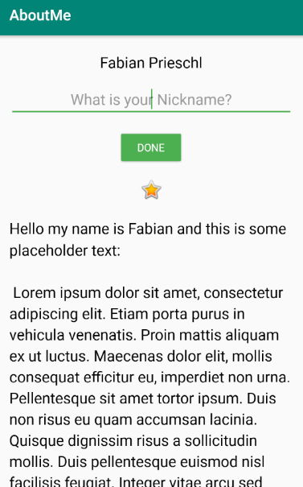
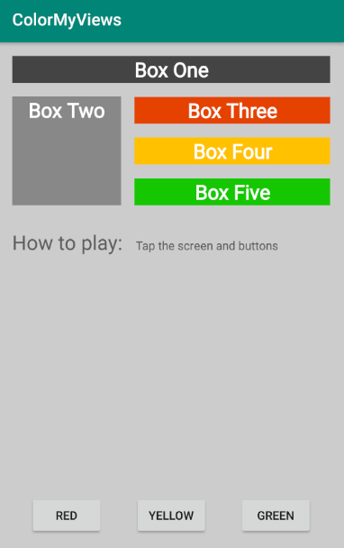

## Developing Android Apps with Kotlin - Fabian Prieschl

### Second Lesson

The purpose of the second lesson was to get more familiar with the layout options we have in android.

Therefore we created 2 applications. (AboutMe, ColorMyViews)

#### Key points of the lesson

* Explanation of basic layouts
* Layout Editor basics
* Styling
* dimens.xml - a file which stores all dimensons e.g. for texts
* Extract styles
* Editable textview
* Visibility depends on something
* Data Binding

#### GUI

