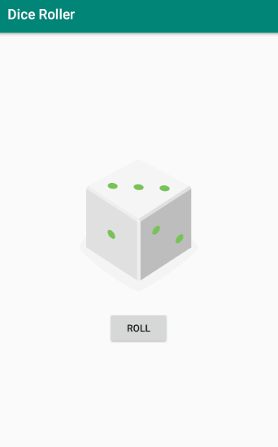

## Developing Android Apps with Kotlin - Fabian Prieschl

### First Lesson

The purpose of the first lesson was to create a Dice Roller program which contains a button and displays a random dice rolling result when the button is pressed.

#### Key points of the lesson

* Installing Android Studio
* Setting up Android Studio
* Emulate Devices
* Introducing project structure - Anatomy
* Explained Activity and Layout
* Button
* Images
* Efficiency -> lateinit
* Explanation of gradle
* Vector Drawables - support for older devices

#### GUI

